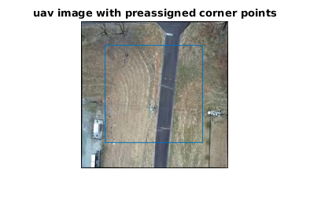
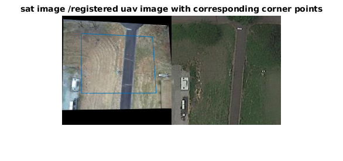

# README

### Generate Deep Lucas Kanade Homography (DLK) dataset for akagi
0. We use the attached matlab script 'gen_akagi_data.mlx' to generate input & template image for DLK method. \
    For sample data refer 'sample_dlk_data.zip' -> contains image pairs with gt homography control points obtained from matlab script and \
                          'Sample_AkagiEarth_DS.zip' -> DLK dataset
1. After *Preprocessing Satellite and UAV Image* - if required, in section: *Satellite and UAV Image Registration*, using cpselect tool fixed points (fp) in satellite image and moving points (mp) in drone image are manually selected to find the projective homography. The more + better these control points are the better is ground truth (gt) homography estimate. [refer](https://de.mathworks.com/help/images/registering-an-aerial-photo-to-an-orthophoto.html)  
2. Using the gt homography we find the corresponding points of satellite image/registered uav image(tgt_points) [[32 32];[159 32];[32 159]; [159 159]], these corner points are fixed as per DLK paper, in original uav image (src_points).  
3. The computed src_points will be used as supervised label for DLK method.
4. Repeat process with different image pair
